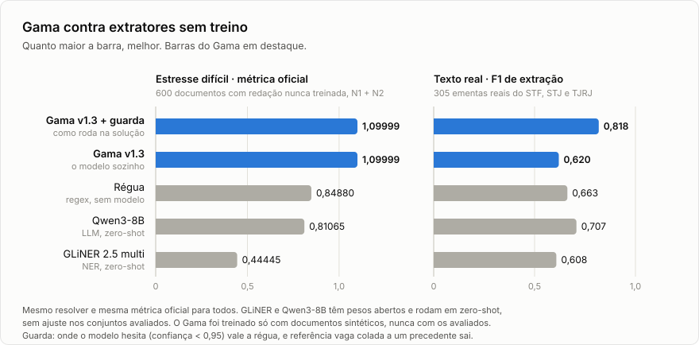

# Gama

Verificador de citações jurídicas do Desafio Caça-Alucinações (BRACIS 2026 × Jusbrasil).

O Gama lê um documento judicial em `.txt`, encontra cada citação de jurisprudência e de
lei e diz se ela é `real`, `inventada` ou `incompleta`. As reais saem ligadas ao `doc_id`
do registro correspondente num acervo congelado de 1.014 decisões. É o problema de
checar se um texto gerado por IA inventou precedente, e o motivo de o desafio existir.

O nome homenageia Luiz Gama (1830–1882), advogado abolicionista que libertou centenas de
pessoas nos tribunais citando a lei com precisão.

[Competição no Kaggle](https://www.kaggle.com/competitions/desafio-jusbrasil-bracis-2026) ·
[pesos do extrator](https://huggingface.co/vinimlo/gama) ·
[manifesto do modelo](MODELO.md) · [base de conhecimento](wiki/INDEX.md)

## Resultados

Tudo medido com a métrica oficial (`vendor/kaggle_metric.py`, cópia exata da que roda no
servidor): `macroF1 · (1 − 0,5·τ) · (1 + 0,10·(1 − Brier))`, com o nível 2 pesando o dobro.
O teto prático é 1,10000.

| Conjunto | Gama v1.3 | Régua (regex, sem modelo) |
|---|---|---|
| Dev da organização, 26 documentos, 192 citações | 1,10000 | 1,09848 |
| Kaggle, fase de treino (o mesmo dev, pontuado no servidor) | 1,09999 | 1,09830 |

O dev set sozinho não diz muita coisa: a própria régua, ajustada a ele, chega a 1,098, e
qualquer candidato bom tira F1 = 1,0 ali. Na [validação por dobras](wiki/experimentos/2026-09-22_validacao-por-dobras.md),
um modelo treinado só com dados sintéticos acerta as 192 citações de documentos da
organização que nunca viu. O que separa os candidatos é o que vem a seguir.

### Contra extratores sem treino

<picture>
  <source media="(prefers-color-scheme: dark)" srcset="bench/grafico-escuro.svg">
  
</picture>

Para medir o que o fine-tune rende, comparamos o Gama com o que dava para conseguir sem
treinar nada dentro das regras do desafio: a régua, o GLiNER 2.5 multi e o Qwen3-8B, os
dois últimos com pesos abertos e em zero-shot. Os quatro passam pelo mesmo resolver e pela
mesma métrica. Até 29/09 a comparação usava o GLiNER multi v2.1 (0,32732 e 0,409); a versão
2.5 é melhor nos dois conjuntos e continua em último, com o lado a lado em
[GLiNER 2.5](wiki/experimentos/2026-09-29_gliner-2-5.md).

| | Gama v1.3 com a guarda | Gama v1.3 sozinho | Régua | Qwen3-8B | GLiNER 2.5 |
|---|---|---|---|---|---|
| Estresse difícil, métrica oficial (600 documentos) | 1,09999 | 1,09999 | 0,84880 | 0,81065 | 0,44445 |
| Texto real, F1 de extração (305 ementas) | 0,818 | 0,620 | 0,663 | 0,707 | 0,608 |
| Tempo por documento numa NVIDIA L4 | 0,037 s | 0,035 s | 0,001 s | 11,7 s | 0,110 s |

O [estresse difícil](wiki/experimentos/2026-09-22_estresse-dificil.md) segue o estilo da
organização, que é o formato anunciado para o conjunto cego, com frases escritas por um LLM
que nenhum modelo viu no treino e ruído de OCR forte. Ali o fine-tune é a diferença: o
melhor extrator sem treino fica abaixo até da régua. Em texto real (ementas do STF, STJ e
TJRJ), o modelo sozinho mostra o próprio limite: especializou no estilo da organização e,
fora dele, marca fragmentos soltos ("Rel", "2011", "DJe"). A [guarda](#a-guarda) conserta
isso sem mudar nenhum documento no estilo da organização e leva o Gama de 0,620 a 0,818 em
texto real (no v1.2, de 0,605 a 0,808). Desenho, números por tipo e leitura no
[benchmark](wiki/experimentos/2026-09-23_bench-extratores-crus.md) e na
[otimização medida](wiki/experimentos/2026-09-23_otimizacao-medida.md).

### Contra modelos treinados nos mesmos dados

O gráfico compara o Gama com extratores sem treino. Para separar o que vem do fine-tune do que
vem da escolha do modelo, treinamos concorrentes nos mesmos 5.410 documentos sintéticos do
v1.2 e medimos todos pelo mesmo harness, sozinhos e com a guarda. Em texto real, as 305
ementas escolheram os limiares e as 172 só confirmam:

| | Texto real sozinho, 305 / 172 | Texto real com a guarda, 305 / 172 | Estresse difícil sozinho, métrica oficial |
|---|---|---|---|
| Gama v1.3 | 0,620 / 0,635 | 0,818 / 0,839 | 1,09999 |
| BERTimbau, receita do v1.2 | 0,697 / 0,705 | 0,813 / 0,826 | 1,09999 |
| GLiNER 2.5 multi treinado | 0,808 / 0,824 | 0,816 / 0,837 | 1,09615 |
| mmBERT com o encoder congelado, só a saída treinada | 0,243 / 0,247 | 0,350 / 0,353 | 0,90182 |

Sozinhos, BERTimbau e GLiNER treinados passam o Gama em texto real, com IC95 acima de zero.
Com a guarda, nenhum passa o v1.3. O GLiNER 2.5 chega lá por outro caminho: sem guarda
nenhuma, fica a −0,010 do v1.3 com a guarda nas 305 (IC95 −0,041 a +0,022) e a −0,015 nas
172 (−0,059 a +0,029). Ele já generaliza fora do molde, e a guarda quase não o ajuda (+0,009
a +0,013), porque a maior parte dos erros dele sai com score acima de 0,99. O Gama especializa
no molde e compensa sabendo quando hesita: é a confiança dele que o leva de 0,620 a 0,818. No
estilo da organização, que é o que o desafio mede, o Gama segue na frente (1,09999 contra
1,09615, 10 erros do GLiNER em 4.447 citações). Isso não é equivalência em texto real: uma
semente por modelo, a receita da biblioteca do GLiNER e IC95 de cerca de 0,04. Com a v2.1
treinada o GLiNER perdia nas 172; a troca de versão mudou essa conclusão.

O encoder congelado vai longe no estilo da organização e desaba em texto real. O fine-tune
rende pela adaptação do encoder. O "mmBERT cru", com a camada de rótulos sem treino, também
foi medido, só como diagnóstico: F1 de 0,0005. Ruído, como esperado.

Retreinamos ainda o v1.2 e o v1.3 com as sementes 7 e 21. Com a guarda, o v1.2 vai de 0,760 a
0,830 nas 305; o v1.3, destilado do mesmo professor, fica entre 0,812 e 0,818. Os +0,019 do
v1.3 sobre o v1.2 na tabela abaixo são do par publicado. Não passam da variação entre
sementes. No estilo da organização as seis sementes dão o mesmo JSON no dev e 1,09999 no
estresse com a guarda.

Falta o teste que mais importa. Todo número de texto real aqui usa um gabarito de LLM
adjudicado, e cada concorrente teve uma semente só; o que ainda não existe é um conjunto novo
de ementas, com gabarito humano, que não tenha participado de nenhuma escolha. Desenho,
intervalos, custos e limites em [controles](wiki/experimentos/2026-09-29_controles.md).

### Gama v1.3: a mesma saída, menor e mais rápido

A solução usa o Gama v1.3: as 12 primeiras das 22 camadas do v1.2, treinadas para imitar as
probabilidades do v1.2 (destilação). No estilo da organização o JSON final é o mesmo do v1.2
em todos os 4.626 documentos medidos; em texto real fica no mesmo nível, com menos variação
entre sementes ([controles](wiki/experimentos/2026-09-29_controles.md))
([D-009](wiki/decisoes/D-009_gama-v1-3-destilado.md), [destilação](wiki/experimentos/2026-09-23_destilacao.md)).
Tempos desta tabela medidos no mesmo job, com os dois modelos lado a lado.

| | v1.2 | v1.3 |
|---|---|---|
| Dev, estresse difícil, final_v1 (4.626 documentos), métrica oficial | 1,10000 / 1,09999 / 1,09999 | iguais, JSON idêntico documento a documento |
| Texto real com a guarda, 172 ementas separadas antes da escolha da guarda | 0,820 | 0,839 (+0,019; IC95 +0,003 a +0,033) |
| Tempo por documento, L4 (estresse) / CPU (dev) | 0,071 s / 1,62 s | 0,046 s / 0,93 s |
| Parâmetros / pesos | 307,5M / 1,23 GB | 257,4M / 1,03 GB |

As 172 ementas foram separadas antes da escolha da guarda e mediram a guarda uma vez só. Depois
elas também serviram para comparar os alunos e escolher o v1.3, então para a diferença entre
v1.2 e v1.3 são dado de desenvolvimento, não um teste independente.

## Como funciona

```
documento .txt
  │
  ├─ extrator Gama      mmBERT-base fine-tunado, classificação de tokens BIO (JURIS, LEI, VAGA);
  │                     lê o documento inteiro numa passada. Sem pesos montados, cai para a régua.
  │
  ├─ guarda             onde o modelo hesita (confiança < 0,95), vale o span da régua; referência
  │                     vaga colada a um precedente sai. No estilo da organização, não muda nada.
  │
  ├─ normalização       desfaz o OCR letra→dígito (l→1, S→5, O→0, G→6, g→9), só no núcleo numérico
  │
  ├─ índice canônico    construído uma vez a partir do SQLite: cabeçalho + autorreferência do feito
  │
  ├─ resolver           lookup O(1) → candidatos; desempate pela cadeia de classe processual
  │
  └─ classificação      1 candidato → real · 0 → inventada · referência vaga → incompleta
                        confiança = probabilidade de acerto medida para aquele tipo de caso
```

A ideia central é dividir o trabalho. O modelo só aprende onde a citação começa e termina
e de que tipo ela é. Quem decide se ela existe é o acervo, por consulta exata. Um modelo que
decidisse `real` ou `inventada` por conta própria estaria chutando com fluência, que é
justamente a alucinação que o desafio quer pegar.

### A guarda

A guarda é o passo entre o extrator e a normalização. Ela existe porque o Gama foi treinado
no estilo da organização e, fora dele, erra de um jeito previsível. Numa ementa com "...;
STJ, REsp 1.999.624/PR, Rel. Min. Fulano, julgado em 10/05/2022", o modelo sozinho acha o
precedente, mas pode marcar também "Rel. Min. Fulano, julgado em 10/05/2022" como se fosse
uma referência vaga do molde. Ou solta pedaços como "Rel", "2011" e "DJe" como citação. Nas
305 ementas do benchmark, esses dois erros somavam centenas de falsos positivos.

O que permite consertar sem estragar o resto é a confiança. Cada span sai do modelo com a
média, sobre os tokens que ele rotulou como citação, da probabilidade que deu ao rótulo
escolhido. No estilo da organização o modelo não hesita. Com o v1.2, nenhum dos 34.171
acertos medidos (dev, estresse difícil e 4.000 sintéticos que ele não treinou) ficou abaixo
de 0,98; com o v1.3, o menor dos 4.447 acertos do estresse difícil fica em 0,9993. Os
falsos positivos do v1.3 em ementa têm confiança mediana de 0,83.

São duas regras, nesta ordem (`src/gama/extratores/guarda.py`):

1. Referência vaga a até 2 caracteres de outro span sai. No molde, a referência vaga é uma
   frase própria ("julgado do STJ proferido em 2021 pela relatoria de ...") e a mais próxima
   de outra citação fica a 4 caracteres, depois de um ponto. Colada a um precedente, ela é o
   rabo dele.
2. Span com confiança abaixo de 0,95 sai. No lugar entra o span da régua que cruza aquele
   trecho, se a régua achou algum e se ele não cruza um span confiante do modelo. Se a régua
   não achou nada ali, o trecho fica sem citação.

No estilo da organização nenhuma das duas dispara. Nos 4.626 documentos medidos, a saída
com e sem guarda é a mesma, então a nota oficial não muda por construção. Em texto real a
história é outra:

| Nas 305 ementas do benchmark (v1.2) | F1 de extração |
|---|---|
| Modelo sozinho | 0,605 |
| Só a regra 1 | 0,684 |
| Só a regra 2 | 0,777 |
| As duas | 0,808 |

Com o v1.3 o salto é de 0,620 para 0,818. Como a guarda foi escolhida olhando essas
ementas, conferimos de dois jeitos que o ganho não é sobreajuste. Escolhendo a regra numa
metade das ementas e medindo na outra, dez vezes, a escolha foi sempre a mesma, com ganho
médio de +0,20. E num teste de 172 ementas sorteadas depois, fora de tudo o que já tinha
sido usado, o ganho foi +0,205 (IC95 +0,154 a +0,246).

A guarda não é um ensemble. A união com a régua, que acrescentava a régua em todo lugar,
custava 61 falsos positivos no nível 2 do estresse
([D-007](wiki/decisoes/D-007_sem-ensemble.md)). A guarda só chama a régua onde o modelo
hesita, e no estilo da organização ele não hesita. O risco que sobra é um conjunto cego com
ruído mais pesado que o nosso estresse derrubar a confiança de uma citação legítima. Aí a
régua assume aquele trecho, e o que se perde é só o que ela também não achar. A imagem
avaliada usa o extrator com a guarda (`--extrator neural`); o modelo sozinho continua
disponível como `--extrator neural-cru`. Decisão completa em
[D-008](wiki/decisoes/D-008_guarda-do-extrator.md).

### Treino com documentos sintéticos

A organização gera os documentos do desafio por moldes: 62% das frases se repetem entre
documentos, cada documento usa uma única data e a quebra de linha segue uma regra que
conseguimos reproduzir byte a byte. Então desmontamos os 26 documentos do dev set em
bancos de peças (preâmbulo, narrativa, enchimento, frases que carregam citação) e
remontamos milhares de documentos novos citando fichas reais do acervo. O rótulo sai
exato por construção, porque sabemos onde pusemos cada citação.

LLMs de pesos abertos (DeepSeek-V4-Pro, Kimi-K3, GLM-5.3) só expandem os bancos de frases.
Nunca escrevem a citação nem decidem rótulo, e nenhum deles roda na solução avaliada. Um
injetor de ruído calibrado no nível 2 da organização completa o conjunto. O Gama v1.2 foi
treinado em 6.000 documentos, 3 épocas, semente 13. O v1.3 é destilado dele, nos
mesmos documentos e em 1.818 [ementas reais](#ementas-reais) sem rótulo, onde só vale a
imitação do v1.2.

### Ementas reais

O dev set e o gerador falam a mesma língua, a dos moldes da organização. Um modelo pode
tirar nota máxima nos dois sem nunca ter lido uma ementa de verdade. Para saber o que
acontece fora do molde, precisávamos de texto jurídico real, público e com uma licença que
nos deixasse publicar o que fizéssemos com ele.

Quem resolveu isso foi o [`celsowm/jurisprudencias_br`](https://huggingface.co/datasets/celsowm/jurisprudencias_br),
que o Celso F. publica no Hugging Face: cerca de 781 mil decisões do STF, do STJ e do TJRJ,
coletadas pelo [Juriscraper](https://github.com/celsowm/juriscraper), ferramenta dele, sob
CC-BY-4.0. Foi nesse texto que o Gama mostrou o ponto fraco. Sem ele, a gente só ia
descobrir no conjunto cego, se descobrisse.

Sorteamos 2.454 ementas por tribunal, cada uma com a proveniência gravada (fonte, licença,
revisão, tribunal e classe), e elas entraram no projeto de três formas:

| Uso | Ementas | O que mediram ou mudaram |
|---|---|---|
| Benchmark de texto real | 305, com 1.085 citações | Mostraram o modelo sozinho marcando fragmentos ("Rel", "2011", "DJe") e deram origem à guarda, que leva o v1.3 de 0,620 a 0,818 |
| Teste intocado | 172, com 682 citações | Sorteadas depois, fora de tudo o que já tinha sido usado, para confirmar a guarda longe das ementas em que ela foi escolhida: +0,205 (IC95 +0,154 a +0,246) |
| Destilação do v1.3 | 1.818, sem rótulo | O resto, sem texto repetido. O aluno só imita as probabilidades do v1.2 e ninguém anota nada. Nas 172 do teste, 0,839 contra 0,820 do v1.2, medida que também serviu para escolher o v1.3 |

O gabarito das 305 e das 172 saiu de duas LLMs anotando cada ementa (DeepSeek-V4-Pro e
Kimi-K3), com as divergências resolvidas por critério escrito e por um terceiro voto
(GLM-5.3). É um ouro de máquina adjudicado, não anotação humana independente.

Uma coisa essas ementas nunca foram: base de resolução. O acervo do desafio é fechado, e um
processo real vindo daqui que coincidisse com um número inventado pela organização viraria
`real` na nossa saída, com a penalidade τ em cima. Elas ensinam e medem onde a citação
está; quem diz se ela existe continua sendo só o acervo. Proveniência, amostragem e limites
em [ementas reais](wiki/conceitos/ementas-reais.md).

O gerador também serviu de teste para o resolver: cada citação renderizada tem rótulo
conhecido, então toda discordância é bug. Foi assim que achamos, por exemplo, uma súmula
do TSE resolvendo como a de mesmo número do STJ, um falso `real` que custaria caro no
conjunto cego.

### Decisões de projeto

Cada escolha que fechou uma porta tem registro próprio, com contexto, conta e medida:

- [D-001](wiki/decisoes/D-001_indice-de-cabecalho.md): índice de cabeçalho em vez de busca FTS por citação, porque acórdãos citam uns aos outros e a busca devolve quem menciona o número, não quem é o processo.
- [D-002](wiki/decisoes/D-002_empate-resolve-para-real.md): empate numa citação numerada resolve para `real`, pela assimetria de custo da métrica.
- [D-004](wiki/decisoes/D-004_gerador-por-moldes.md): o goldenset remonta os moldes da organização em vez de pedir a um LLM que redija documentos.
- [D-006](wiki/decisoes/D-006_calibracao-decide-o-topo.md): a confiança é a taxa de acerto medida por balde, porque no topo do ranking quem desempata é o bônus de calibração.
- [D-007](wiki/decisoes/D-007_sem-ensemble.md): sem ensemble; a união com a régua fica como opção para texto fora do estilo da organização.
- [D-008](wiki/decisoes/D-008_guarda-do-extrator.md): onde o modelo hesita (confiança < 0,95) vale a régua, porque no estilo da organização ele nunca hesita e fora dele é aí que erra; o resolver desempata pela cadeia de classe compatível.
- [D-009](wiki/decisoes/D-009_gama-v1-3-destilado.md): o extrator é o v1.2 destilado em 12 camadas, porque entrega o mesmo JSON no estilo da organização e roda mais rápido; em texto real fica no mesmo nível do v1.2.

## Como rodar

Tudo roda em container. Os dados da organização não são redistribuídos: baixe a aba Data
da competição e coloque `desafio1_bracis.db` e a pasta `txt/` em `dados/`.

```bash
scripts/baixar_pesos.sh   # pesos na revisão fixa do MODELO.md, em ./modelos
make build                # imagem de desenvolvimento
make dados                # confere se os dados estão no lugar
make predizer             # dados/txt → saidas/json
make avaliar              # métrica oficial, por nível
make erros                # erros restantes por categoria
make submissao            # saidas/submission.csv pelo conversor oficial
make test                 # testes
```

### Contrato de execução da organização

A imagem avaliada é o alvo padrão do `Dockerfile` (torch com CUDA 12.6). Pesos e dados
chegam por volume e nada sai para a rede:

```bash
docker build -t gama .
docker run --rm --gpus all --network none \
  -v "$PWD/modelos:/models:ro" \
  -v "$PWD/dados:/app/dados:ro" \
  -v /caminho/entrada:/data/in:ro \
  -v /caminho/saida:/data/out \
  gama --input /data/in --output /data/out
```

O stderr informa `extrator: neural`. Se o volume dos pesos faltar, aparece um aviso e o
pipeline segue com a régua, porque uma saída válida vale mais que uma submissão vazia. Sem
GPU visível o extrator roda em CPU, em cerca de 1 s por documento, dentro do teto de 60 s.

## Reprodutibilidade

| Item | Onde está |
|---|---|
| Código | este repositório; cada submissão cita o commit que produziu as saídas |
| Modelo | [`vinimlo/gama`](https://huggingface.co/vinimlo/gama), revisão fixa no [MODELO.md](MODELO.md); destilado do v1.2, que parte de [`jhu-clsp/mmBERT-base`](https://huggingface.co/jhu-clsp/mmBERT-base) (MIT), também com revisão fixa |
| Ambiente | `Dockerfile` (Python 3.12, torch 2.14.0) e `requirements.txt` com versões fixadas |
| Comando | o bloco acima |
| Determinismo | inferência em `eval()` sem amostragem, algoritmos determinísticos do torch, `PYTHONHASHSEED=0`; a saída é a mesma em GPU e em CPU |
| Rede | nenhuma chamada em tempo de execução (`HF_HUB_OFFLINE=1`) |
| Dados | fora da imagem e fora do repositório; chegam por volume |
| Dados de treino | [`vinimlo/gama-goldenset`](https://huggingface.co/datasets/vinimlo/gama-goldenset), revisão no [MODELO.md](MODELO.md): documentos sintéticos (MIT) e ementas de [`celsowm/jurisprudencias_br`](https://huggingface.co/datasets/celsowm/jurisprudencias_br) (CC-BY-4.0) |

O treino é um script UV (`treino/treinar.py`, dependências fixadas no cabeçalho) que roda
em HF Jobs, lê o goldenset numa revisão fixa do Hub e publica os pesos:

```bash
hf jobs uv run --flavor a10g-large --secrets HF_TOKEN treino/treinar.py \
  --dados vinimlo/gama-goldenset --revisao <sha> \
  --modelo-base jhu-clsp/mmBERT-base --saida vinimlo/gama
```

O v1.3 sai do v1.2 por destilação (`treino/destilar.py`, mesmo formato; revisões no
[MODELO.md](MODELO.md)):

```bash
hf jobs uv run --flavor a100-large --timeout 3h --secrets HF_TOKEN treino/destilar.py \
  --dados vinimlo/gama-goldenset --revisao <sha> \
  --professor vinimlo/gama --professor-rev <sha do v1.2> \
  --aluno podado --camadas 0,1,2,3,4,5,6,7,8,9,10,11 --saida vinimlo/gama
```

## Estrutura

```
src/gama/     pipeline: extração, normalização, índice, resolver, classificação
avaliacao/    harness da métrica oficial, catálogo de erros, calibração, inspeção sem gabarito
geracao/      gerador sintético pelos moldes da organização e expansão dos bancos por LLM
treino/       fine-tune, validação por dobras, ensaio no hardware-alvo
reais/        ementas do celsowm/jurisprudencias_br: ingestão, anotação, adjudicação, sorteio do teste
vendor/       código da organização, intocado (métrica e conversor oficiais)
tests/        regressões do resolver, sondas de ruído, determinismo
bench/        benchmark contra extratores sem treino (GLiNER, Qwen3-8B, régua)
wiki/         decisões, experimentos e conceitos
```

Quatro invariantes quebram em silêncio se forem violadas:

1. A tabela de OCR letra→dígito só se aplica ao núcleo numérico (`span.digitos`), nunca ao
   trecho inteiro. Aplicada a um prefixo como `AgInt` ou `TST-ED-E-ED-RR`, ela gera uma
   chave fantasma e o sintoma é só "zero candidatos". Esse bug apareceu três vezes.
2. `vendor/` não se edita. É a cópia exata da métrica do servidor; mexer nela faz o número
   local divergir do leaderboard.
3. Em `extrair()`, as referências vagas registram antes dos números. Senão o ano
   (`em 2024`) é capturado como número de processo.
4. A confiança vem de `src/gama/calibracao.json`, medida por `avaliacao/calibrar.py` e
   nunca escrita à mão. Nunca 1,0: confiança alta em cima de erro é o pior caso do Brier.

## Licença

MIT, ver [LICENSE](LICENSE). A exceção é `vendor/`, cópia do código da organização do
desafio (métrica e conversor oficiais), que segue os termos dela. As ementas reais não
estão neste repositório: ficam no dataset, com a CC-BY-4.0 do `celsowm/jurisprudencias_br`
e a proveniência de cada registro.

## Equipe

Vinícius Melo e Gabriel Siron
