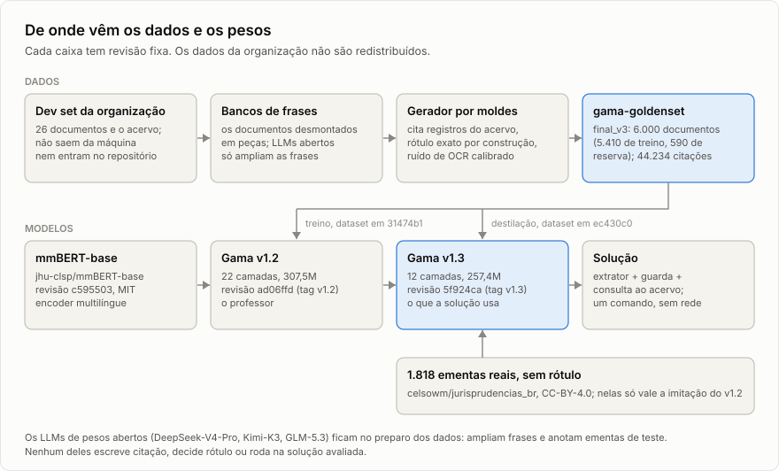

# Reprodução passo a passo

Dois níveis. Rodar a solução pede dois comandos e só Docker. Refazer o caminho inteiro, dos
26 documentos do dev até os pesos publicados, tem sete passos, e cada um está aqui com o
comando exato e com o que foi conferido em 30/09/2026.

<picture>
  <source media="(prefers-color-scheme: dark)" srcset="../../docs/figuras/linhagem-escuro.svg">
  
</picture>

## O que cada nível precisa

| Para | Precisa de |
|---|---|
| Rodar a solução | bash e Docker; rede só na preparação; GPU é opcional |
| Passos 1 a 3 (dados sintéticos) | os dados da organização em `dados/` (aba Data da competição, só para equipes inscritas) |
| Ampliar os bancos e anotar ementas | um servidor Ollama com os modelos abertos do `geracao/llm.py`, em `OLLAMA_HOST_URL` |
| Passos 4, 5 e o ensaio em GPU | conta no Hugging Face com HF Jobs e `HF_TOKEN` |

Nenhum passo de desenvolvimento roda na avaliação. O que os LLMs e o gerador produziram
está congelado no dataset [`vinimlo/gama-goldenset`](https://huggingface.co/datasets/vinimlo/gama-goldenset),
com revisão fixa, e os pesos estão em [`vinimlo/gama`](https://huggingface.co/vinimlo/gama).
Refazer os pesos parte do dataset e não chama LLM nenhum.

## Rodar a solução

```bash
bash run.sh --preparar                                      # com rede, uma vez
bash run.sh <caminho_db> <pasta_txt> <arquivo_saida.csv>    # sem rede
```

O primeiro constrói a imagem e baixa os pesos na revisão do `MODELO.md`. O segundo grava o
CSV da submissão e, ao lado, um JSON por documento. Requisitos, saídas, variáveis e
problemas comuns estão no [README](../../README.md#para-quem-vai-avaliar).

Conferido em 30/09/2026: com a base e os 26 documentos do dev, o CSV sai idêntico, byte a
byte, ao da submissão do v1.3, com `extrator: neural` no log.

## 1. Bancos de frases

Os 26 documentos do dev saem de um gerador por moldes. O primeiro passo desmonta cada um em
peças (preâmbulo, narrativa, enchimento, frases que carregam citação) e grava os bancos:

```bash
docker compose run --rm gama python -m geracao.bancos
# -> corpus/bancos/org.json
```

Conferido: o comando reproduz o `org.json` usado no treino, byte a byte.

LLMs de pesos abertos escrevem variantes das frases, no mesmo registro. Nada do que eles
escrevem carrega citação: a régua rejeita o que carregar, e o rótulo continua exato por
construção.

```bash
docker compose run --rm lab python -m geracao.expandir --saida /app/corpus/bancos/llm.json
```

As respostas ficam em cache (`corpus/llm_cache`), então repetir o comando não chama o
modelo de novo. Hoje o comando chama os três modelos e grava tudo em `llm.json`. O treino
usou a primeira rodada, só com DeepSeek-V4-Pro e Kimi-K3, guardada como `llm_v1.json`. As
frases do GLM-5.3, que vieram depois, foram separadas em `llm_glm.json` e ficaram só no
estresse difícil, para que nenhum modelo treinado as tenha visto. Essa separação não tem
comando no repositório: os três arquivos ficam em `corpus/bancos`, fora do git. É mais um
motivo para a reprodução dos pesos partir do dataset congelado.

## 2. Goldenset

O gerador remonta documentos novos com as peças dos bancos, cita registros do acervo e
injeta o ruído de OCR do nível 2. Tudo sai de `random.Random(semente + i)` por documento.

```bash
# treino: 6.000 documentos (5.410 de treino, 590 de reserva)
docker compose run --rm gama python -m geracao.gerar --n 6000 --semente 11 \
  --bancos /app/corpus/bancos/org.json,/app/corpus/bancos/llm_v1.json \
  --saida /app/corpus/goldenset/v3

# estresse difícil: 600 documentos com frases que nenhum treino usou
docker compose run --rm gama python -m geracao.gerar --n 600 --semente 99 --fracao-llm 0.9 \
  --bancos /app/corpus/bancos/org.json,/app/corpus/bancos/llm_glm.json \
  --saida /app/corpus/goldenset/estresse_glm
```

Cada pasta traz `txt/`, `goldenset_offsets.csv` (o mesmo esquema do gabarito da organização),
`meta.jsonl` e `relatorio.json`, com os portões de qualidade: documento descartado, e onde
o resolver discorda do rótulo. Cada discordância é caso de teste do resolver.

Conferido: duas execuções do mesmo comando dão os mesmos bytes. Contra o conjunto guardado,
o comando do treino reproduz 5.978 dos 6.000 documentos byte a byte, com as mesmas 44.234
citações; o do estresse, 278 dos 600. Os bancos são os mesmos e a base é a mesma, então a
diferença vem do código do gerador, que recebeu correções depois da geração. Por isso o
conjunto que vale é o congelado no dataset, não uma geração nova.

## 3. Pacote de treino

Junta os conjuntos, copia o pacote `gama` que os scripts de treino importam e publica no
Hub. Os dados da organização nunca entram no pacote.

```bash
docker compose run --rm lab python -m treino.empacotar \
  --goldenset final_v3=/app/corpus/goldenset/v3,estresse_glm=/app/corpus/goldenset/estresse_glm \
  --saida /app/corpus/pacote/v3 --repo <usuario>/gama-goldenset
```

O commit do Hub que o comando devolve é a revisão que entra nos passos seguintes. As que
produziram os pesos publicados estão no [MODELO.md](../../MODELO.md): `31474b1` para o v1.2
e `ec430c0` para o v1.3.

## 4. Treino do Gama v1.2

`treino/treinar.py` é um script UV, com as dependências fixadas no cabeçalho. Lê o dataset
na revisão fixa, ajusta o mmBERT-base e publica os pesos:

```bash
hf jobs uv run --flavor a100-large --secrets HF_TOKEN treino/treinar.py \
  --dados vinimlo/gama-goldenset --revisao 31474b1f7db9096c4ca4f2a4eae2e9b82852d7a7 \
  --subpasta final_v3 --modelo-base jhu-clsp/mmBERT-base --max-len 1024 \
  --saida <usuario>/gama
```

Três épocas, lote 8, taxa de aprendizado 5e-5 e semente 13 são os padrões do script. O
`--subpasta final_v3` e o `--max-len 1024` não são: sem eles o script procura a pasta
`goldenset` e usa janelas de 2.048 tokens. O mmBERT-base estava na revisão `c595503` quando
o v1.2 foi treinado. A mesma receita treinou os modelos da validação por dobras numa A10G de
24 GB (`--flavor a10g-large`); a A100 só encurta o tempo.

## 5. Destilação do Gama v1.3

O aluno nasce com as 12 primeiras camadas do v1.2 e aprende as probabilidades dele, nos
mesmos documentos e em 1.818 ementas reais sem rótulo:

```bash
hf jobs uv run --flavor a100-large --timeout 3h --secrets HF_TOKEN treino/destilar.py \
  --dados vinimlo/gama-goldenset --revisao ec430c0373f6ef96ba3bb91a3f11b24e391c5e6a \
  --professor vinimlo/gama --professor-rev ad06ffd34e838bf3496645d9c16281dfc70cb871 \
  --aluno podado --camadas 0,1,2,3,4,5,6,7,8,9,10,11 --saida <usuario>/gama
```

Os padrões do script são os do v1.3: pasta `final_v3`, 3 épocas, `max_len` 2048, lote 8,
taxa 5e-5, semente 13 e a perda `0,5·CE(ouro) + T²·KL(professor/T ‖ aluno/T) + 0,5·KL(professor ‖ aluno)`
com T = 2. Levou 18 minutos numa A100 de 80 GB. Medidas e escolha em
[destilação](../experimentos/2026-09-23_destilacao.md) e
[D-009](../decisoes/D-009_gama-v1-3-destilado.md).

## 6. Calibração da confiança

A confiança publicada em cada citação é a taxa de acerto medida para aquele tipo de caso,
em dados rotulados que o modelo não treinou ([D-006](../decisoes/D-006_calibracao-decide-o-topo.md)):

```bash
docker compose run --rm gama python -m avaliacao.calibrar \
  --conjunto /app/dados --conjunto /app/corpus/goldenset/estresse_glm \
  --extrator neural --modelos /models --saida /app/saidas/calibracao.json
```

A tabela medida vai para `src/gama/calibracao.json`. Ela nunca é escrita à mão e nunca
chega a 1,0.

## 7. Conferência de entrega

O que um modelo novo precisa passar antes de virar a revisão do `MODELO.md`:

```bash
make test                                   # regressões do resolver, sondas de ruído, determinismo
make avaliar                                # métrica oficial no dev, por nível
bash run.sh <db> <pasta_txt> <saida.csv>    # a imagem de entrega, sem rede

# tempo por documento, GPU contra CPU e duas execuções na GPU, numa L4 de 24 GB
hf jobs uv run --flavor l4x1 --secrets HF_TOKEN treino/ensaio.py \
  --dados vinimlo/gama-goldenset --revisao <sha> --pesos vinimlo/gama --pesos-rev <sha>
```

## Ementas reais e benchmark

As ementas do [`celsowm/jurisprudencias_br`](https://huggingface.co/datasets/celsowm/jurisprudencias_br)
medem o que acontece fora do molde e entram sem rótulo na destilação. Não fazem parte do
caminho dos pesos do v1.2.

```bash
docker compose run --rm lab python -m reais.ingerir --n 3000      # amostra por tribunal, com proveniência
docker compose run --rm lab python -m reais.anotar                # duas LLMs anotam onde Gama e régua divergem
docker compose run --rm lab python -m reais.adjudicar             # critério escrito e terceiro voto
docker compose run --rm gama python -m reais.sortear_teste        # 200 ementas novas; o resto vai para a destilação
```

O benchmark contra extratores sem treino extrai o estresse e as ementas em GPU (HF Jobs,
L4) e pontua tudo aqui, com o mesmo resolver e a mesma métrica:

```bash
docker compose run --rm gama python -m bench.conjuntos
hf jobs uv run --flavor l4x1 --secrets HF_TOKEN bench/extrair_gama.py \
  --dados vinimlo/gama-goldenset --revisao <sha> --pesos vinimlo/gama --pesos-rev <sha>
hf jobs uv run --flavor l4x1 --secrets HF_TOKEN bench/extrair_gliner.py \
  --dados vinimlo/gama-goldenset --revisao <sha>
hf jobs uv run --flavor l4x1 --secrets HF_TOKEN bench/extrair_qwen.py \
  --dados vinimlo/gama-goldenset --revisao <sha>
docker compose run --rm gama python -m bench.pontuar              # -> bench/resultados.json
make figuras                                                      # redesenha o gráfico e as figuras
```

Os documentos do dev são da organização e não sobem para o HF Jobs: neles só rodam a régua
e o Gama, na máquina local. Desenho e leitura em
[benchmark](../experimentos/2026-09-23_bench-extratores-crus.md),
[ementas reais](../conceitos/ementas-reais.md) e
[controles](../experimentos/2026-09-29_controles.md).
